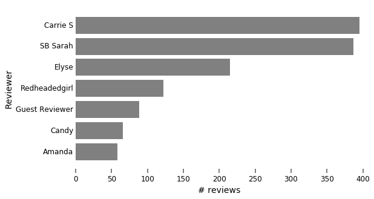
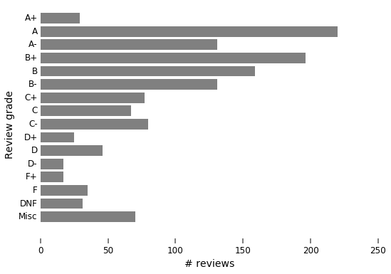
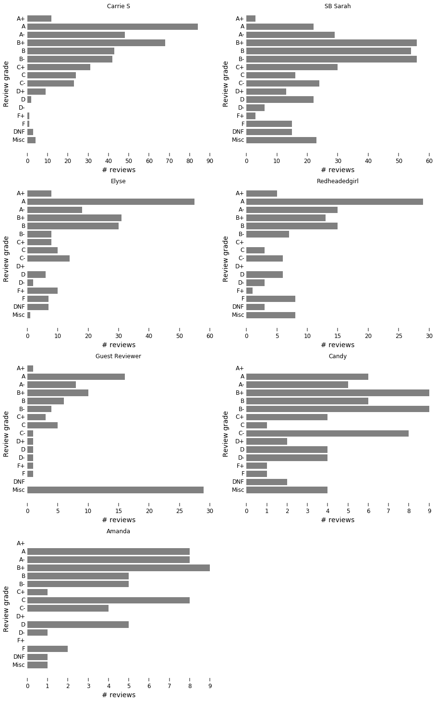

# SBTB grade analysis
This is a markdown version of the jupyter notebook ```analysis_sbtb.ipynb```, while I'm working, I hate saving doing version control on the output of jupyter notebooks, so this serves as an output checkpoint.

This goes through an overview of the data pulled, looking at grade distribution and genres for site and by reviewer.


```python
%matplotlib inline

import matplotlib.pyplot as plt
import pandas as pd
import numpy as np
import sqlite3 as sql
import pprint
```

---

## Load data


```python
# open database, import data into pandas
conn = sql.connect("sbtb.db")
df = pd.read_sql_query("SELECT * from Reviews;", conn)

print(df.head())

conn.close()
```

       Id Review_date                                               Link  \
    0   1  2016-07-06  http://smartbitchestrashybooks.com/reviews/mak...   
    1   2  2016-07-05  http://smartbitchestrashybooks.com/reviews/her...   
    2   3  2016-06-30  http://smartbitchestrashybooks.com/reviews/ple...   
    3   4  2016-06-28  http://smartbitchestrashybooks.com/reviews/all...   
    4   5  2016-06-23  http://smartbitchestrashybooks.com/reviews/emi...   

            Reviewer Grade                     Title            Author  Pub_year  \
    0          Elyse    C-          Make Me Love You   Johanna Lindsey    2016.0   
    1       Carrie S    B+           Heroine Complex        Sarah Kuhn    2016.0   
    2       SB Sarah    B-         Please Release Me      Rhoda Baxter    2015.0   
    3  Redheadedgirl     A                    All In  Simona Ahrnstedt    2016.0   
    4       SB Sarah    B+  Emily and the Dark Angel       Jo Beverley    1992.0   

                                               Genres  guest_review  \
    0                   Romance; Historical: European             0   
    1                         Science Fiction/Fantasy             0   
    2  Women's Fiction; Romance; Contemporary Romance             0   
    3                   Romance; Contemporary Romance             0   
    4          Romance; Historical: European; Regency             0   

                                           Themes  
    0  Marriage of Convenience; Enemies to Lovers  
    1                                              
    2                                              
    3                           Enemies to Lovers  
    4        Small Town; Crush; Opposites Attract  


---

## Plot reviewer distribution
Number of reviews by each unique reviewer


```python
#print(df['Reviewer'].unique())
reviewers = df[['Reviewer','Id']]
reviewer_count = reviewers.groupby('Reviewer').count().sort_values('Id')
#print(reviewer_count)
#reviewer_count.sort_values(['Id']).plot(kind='barh',sort_columns=True,legend=False)

y_pos = np.arange(len(reviewer_count))

fig = plt.figure(figsize=(8.5, 5))
ax = fig.add_subplot(111)
ax.set_frame_on(False)

ax.barh(y_pos, reviewer_count['Id'], align='center', color='grey', lw=0)
ax.set_yticks(y_pos)
ax.set_yticklabels(reviewer_count.index)

ax.set_xlabel('# reviews', size=14)
ax.set_ylabel('Reviewer', size=14)

ax.yaxis.set_ticks_position('none')
ax.yaxis.set_tick_params(labelsize=12)

ax.xaxis.set_ticks_position('bottom')
ax.xaxis.set_tick_params(width=2, length=7, color='grey', labelsize=12)


plt.show()

```





---

## Rendering grades

For proper rendering of column names, grades should be converted to numbers. Make an inverted grade dictionary with ```-1``` set to 'Misc' for plotting ease. Saved in a new column ```grade_num```.

Let's use a 5 point scale +/- 0.3 for plus and minus.


```python
#print(df.Grade.unique())
grade_dict = {
    'A+': 5.3,
    'A' : 5.0,
    'A-': 4.7,
    'B+': 4.3,
    'B' : 4.0,
    'B-': 3.7,
    'C+': 3.3,
    'C' : 3.0,
    'C-': 2.7,
    'D+': 2.3,
    'D' : 2.0,
    'D-': 1.7,
    'F+': 1.3,
    'F' : 1.0,
    'DNF' : 0.,
    'Rant' : -1,
    'Squee' : -1,
    'N/A' : -1
}

grade_dict_invert = {v: k for k, v in grade_dict.items()}
grade_dict_invert[-1] = 'Misc'
```


```python
for grade in grade_dict:
    df.loc[df["Grade"] == grade,"grade_num"] = grade_dict[grade]
```

---

## Plot grade distribution
Full site, all reviews by all reviewers


```python
grades = df[['grade_num','Id']]
grades_count = grades.groupby('grade_num').count(); #print((grades_count['Id']))
#print(grades_count)
#grades_count.sort_values(['Id']).plot(kind='barh',legend=False,grid=True)

y_pos = np.arange(len(grades_count));
y_labels = [grade_dict_invert[k] for k in grades_count.index]
#print(y_labels)

fig = plt.figure(figsize=(8.5, 6))
ax = fig.add_subplot(111)
ax.set_frame_on(False)

ax.barh(y_pos, grades_count['Id'], align='center', color='grey', lw=0)
ax.set_yticks(y_pos)
ax.set_yticklabels(y_labels)

ax.set_xlabel('# reviews', size=14)
ax.set_ylabel('Review grade', size=14)

ax.yaxis.set_ticks_position('none')
ax.yaxis.set_tick_params(labelsize=12)

ax.xaxis.set_ticks_position('bottom')
ax.xaxis.set_tick_params(width=2, length=7, color='grey', labelsize=12)
plt.show()


#grades_count.plot(kind='barh',legend=False,grid=True)
```





---

## Plot grade distribution by reviewer

Now we want to look at grade distributions for each reviewer.
I would expect Guest Reviews are going to be bimodal (very positive or very negative).


```python
def fill_grade_gaps(grade_df):
    # Want all possible grades, any not in dataframe will be set to zero
    if len(grade_df) == len(grade_dict_invert):
        return grade_df
    df_zeros = pd.DataFrame(0, index=sorted(list(grade_dict_invert.keys())), columns=['Id'])
    return grade_df.add(df_zeros, fill_value=0)
```


```python
reviewers = df['Reviewer'].unique()

fig = plt.figure(figsize=(15,25))

for i, reviewer in enumerate(reviewer_count.index):
    #print(reviewer)
    grades = df[df['Reviewer']== reviewer]
    grades = grades[['grade_num','Id']]
    grades_count = grades.groupby('grade_num').count(); #print(grades_count)
    grades_count = fill_grade_gaps(grades_count)

    ax = fig.add_subplot(4,2,7-i)
    ax.set_frame_on(False)

    y_pos = np.arange(len(grades_count));
    ax.barh(y_pos, grades_count['Id'], align='center', color='grey', lw=0)

    ax.set_title(reviewer)

    ax.set_yticks(y_pos)
    ax.set_yticklabels(y_labels)

    ax.set_xlabel('# reviews', size=14)
    ax.set_ylabel('Review grade', size=14)

    ax.yaxis.set_ticks_position('none')
    ax.yaxis.set_tick_params(labelsize=12)

    ax.xaxis.set_ticks_position('bottom')
    ax.xaxis.set_tick_params(width=2, length=7, color='grey', labelsize=12)


    #grades_count.plot(kind='bar',legend=False,grid=True,title=reviewer)

plt.show()
```





---

## Calculate the review GPA

Ignore any of the "Miscellaneous" category entries, mostly those are "Rant" and "Squee" reviews. It's like an audit.

This calculation could be put into the title of the above bar charts.


```python
for i, reviewer in enumerate(reviewer_count.index):
    grades = df[(df['Reviewer']==reviewer) & (df['grade_num']>-1)]['grade_num']
    print('{} GPA: {:.2f}'.format(reviewer, grades.sum()/grades.count()))
```

    Amanda GPA: 3.62
    Candy GPA: 3.37
    Guest Reviewer GPA: 4.08
    Redheadedgirl GPA: 3.82
    Elyse GPA: 3.81
    SB Sarah GPA: 3.41
    Carrie S GPA: 4.07


---

## Find top genres reviewed

I believe "Romance" might be one of those genres, so that might need to be kicked out if it's the top genre for all reviewers. There might be consistency issues with how genres were done in the past versus now.

Multi-genre books have genres separated by semicolons. First, let's do the whole site, then by reviewer. Looping does not feel ideal, but the multi-genre thing is a killer.

Let's only look at graded reviews, so those not assigned a "miscellaneous" grade.


```python
genresdb = df[df['grade_num'] > -1]['Genres']; print("Total reviews: {}\n".format(genresdb.count()))
genres = {}
for genre in genresdb:
    genre_list = [g.strip() for g in genre.split(';')]
    for g in genre_list:
        genres.setdefault(g, 0)
        genres[g] += 1

pprint.pprint(genres)
```

    Total reviews: 1261

    {'Anthology': 2,
     'Art': 2,
     'Chick Lit': 13,
     'Classic': 19,
     'Comic': 26,
     'Contemporary Romance': 274,
     'Contemporary/Other': 10,
     'Cookbook': 11,
     'Erotica/Erotic Romance': 60,
     'Fantasy/Fairy Tale Romance': 12,
     'GLBT': 45,
     'Gothic': 3,
     'Graphic Novel': 18,
     'Historical': 165,
     'Historical: American': 26,
     'Historical: European': 137,
     'Historical: Other': 14,
     'Horror': 17,
     'Humor': 10,
     'Inspirational': 1,
     'Literary Fiction': 27,
     'Memoir': 10,
     'Middle Grade': 1,
     'Mystery/Thriller': 47,
     'New Adult': 19,
     'Nonfiction': 86,
     'Not a Book': 1,
     'Novella': 28,
     'Paranormal': 84,
     'Regency': 41,
     'Romance': 362,
     'Romantic Suspense': 41,
     'Science Fiction/Fantasy': 215,
     'Steampunk': 15,
     'Teen Fiction': 2,
     'Time Travel': 13,
     'Top 100 Banned Books': 21,
     'Urban Fantasy': 22,
     'Western': 1,
     "Women's Fiction": 13,
     'Young Adult': 76}


---

## Find top 5 genres for each reviewer


```python
for i, reviewer in enumerate(reviewer_count.index):
    genresdb = df[(df['Reviewer']==reviewer) & (df['grade_num'] > -1)]['Genres'];

    print("\nReviewer: {}".format(reviewer))

    genres = {}
    for genre in genresdb:
        genre_list = [g.strip() for g in genre.split(';')]
        for g in genre_list:
            genres.setdefault(g, 0)
            genres[g] += 1
    reviewer_genres = pd.DataFrame.from_dict(genres, orient='index').rename(columns={0:'count'})
    pprint.pprint(reviewer_genres.sort_values(by='count', ascending=False)[:5])
```


    Reviewer: Amanda
                             count
    Romance                     34
    Contemporary Romance        22
    Erotica/Erotic Romance      12
    Paranormal                   6
    Science Fiction/Fantasy      5

    Reviewer: Candy
                             count
    Historical                  23
    Science Fiction/Fantasy     10
    Contemporary Romance        10
    Paranormal                   8
    Literary Fiction             3

    Reviewer: Guest Reviewer
                            count
    Romance                    23
    Contemporary Romance       19
    Historical                  9
    Erotica/Erotic Romance      6
    GLBT                        6

    Reviewer: Redheadedgirl
                          count
    Romance                  52
    Historical: European     32
    Historical               27
    Contemporary Romance     13
    Nonfiction                8

    Reviewer: Elyse
                          count
    Romance                 114
    Contemporary Romance     54
    Historical: European     43
    Romantic Suspense        26
    Mystery/Thriller         24

    Reviewer: SB Sarah
                          count
    Contemporary Romance    131
    Historical               70
    Romance                  51
    Paranormal               35
    Young Adult              26

    Reviewer: Carrie S
                             count
    Science Fiction/Fantasy    154
    Romance                     88
    Nonfiction                  64
    Historical: European        45
    Young Adult                 34


```python

```
